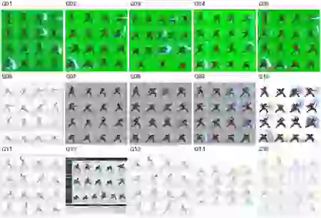

# animation_pixel

**把像素近战动画的反复试错，变成有证据、能复用、可回归的生产规范。**

研究样本：黑发剑士三连斩。当前确认的动作方向为 **左上→右下、右上→左下、低位→高位上挑**；面向同一目标前进，16个输出帧，默认不跳跃。

## 先读这些文件

| 入口 | 内容 |
|---|---|
| [AGENTS.md](AGENTS.md) | 后续 ChatGPT / Codex / Agent 每次开工前必须读取的项目规则 |
| [讨论与决策记录](docs/01_discussion_log.md) | 用户如何发现问题、哪些结论保留、哪些旧说法需要纠正 |
| [Motion Planner v2.0 整理版](docs/02_motion_spec_v2.md) | 六通道、语义段、参考分工、受控生成与验收 |
| [失败案例目录](docs/03_failure_catalog.md) | 错误编号、实际图像ID、原因假设、回归要求 |
| [三连斩案例](cases/triple_slash_001/README.md) | 15版生成图的演进；包含成功经验和仍未解决的问题 |
| [Image2开源项目研究](docs/04_open_source_review.md) | 区分提示词图库、生成工具和动画工作流；明确借鉴边界 |
| [实施状态与下一步](docs/05_validation_and_roadmap.md) | 已做、未做、验收条件，不把规划写成成品 |
| [图片清单](assets/manifest.json) | 24个去重原文件的SHA-256、实际尺寸、透明度、来源和状态 |

## 当前事实，而不是宣传

- 已整理本会话的动作设计和失败记录；该讨论记录是**整理稿，不是逐字聊天导出**。
- 本地完整档案包含 **15张生成序列图 + 9个参考/派生文件，共24个去重文件**；原始字节不重绘、不裁切、不缩放。
- 用户曾报告骨架、套皮和特效的GIF预览有力量/比较满意；用户制作的这些GIF未上传，不能写成仓库已保存了这些动画。
- 后来发现腿部交替、转体、头朝向等问题。因此“视觉满意”不等于“全身运动正确”，更不等于“游戏导入验收通过”。
- **自动动作规划器、头朝向识别、左右腿跟踪、物理验证、自动局部修复尚未实现。**目前只有可执行的归档/文件校验工具。
- 首次远端文档提交中，完整原图二进制仍待上传；`assets/manifest.json`明确标记状态。少量诊断预览与原图不能混称。

## 图像案例缩略总览



## 不再重复的六条教训

1. 身体和剑路成立以前，不用刀光掩盖问题。
2. 身体转体、头部追踪目标、武器运动是不同通道；不能把朝左下挥剑变成朝左看敌人。
3. 前后脚是当前站位，左右腿是永久身份；手跨过身体中线不等于换手。
4. 按世界坐标检查支撑脚；程序推动root时，不能要求局部脚坐标也永远固定。
5. 固定相机和骨骼比例，不是固定每帧人物包围盒或二维投影剑长。
6. 已确认图像的去底、切帧、打包属于导出；不得悄悄再生图然后称为无损导出。

## 文件校验

```bash
python -m pip install -r requirements.txt
python scripts/validate_archive.py --root . --metadata-only
python scripts/validate_archive.py --root . --require-originals
python -m unittest discover -s tests -v
```

`--metadata-only`只检查清单一致性，不代表图片已经存在；`--require-originals`在原图缺失、哈希不符或元数据不符时失败。

完整ZIP在本次会话中交付。使用已登录GitHub CLI的本地终端，可以一次上传原图，不需要逐张操作：

```bash
python scripts/upload_archive_assets.py --archive /path/to/animation_pixel_full_archive.zip --repo bingbingchang/animation_pixel --branch archive/2026-09-19-motion-cases --dry-run
python scripts/upload_archive_assets.py --archive /path/to/animation_pixel_full_archive.zip --repo bingbingchang/animation_pixel --branch archive/2026-09-19-motion-cases --execute
```

此脚本只上传清单中列出的原文件，校验SHA-256，通过`gh api`创建blob/tree/commit，并以非强制方式更新指定分支。它不上传其他目录，不调用生图API，不读取或打印密钥。上传回执为`reports/originals-upload-receipt.json`；清单中的初始待上传状态是历史快照。

## 资产与授权范围

失败图是研究案例，不是合格技能包。拳皇GIF、DNF截图及其派生图仅作为用户提供的第三方动作参考；不要当作自制素材分发或默认应用本项目许可证。原始剑士参考图的来源许可也尚未核实。详见[资产范围说明](docs/06_asset_scope.md)。
