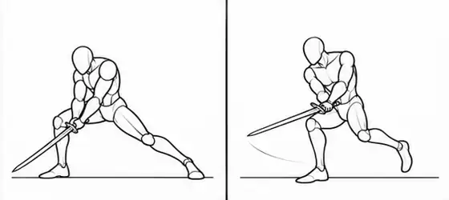

# 失败案例与回归规则

每项区分观察、用户报告与原因假设。归档图片不表示它是正确参考。索引编号Gxx映射到`assets/manifest.json`。

| ID | 失败 | 实际案例 | 证据与根因假设 | 下次回归要求 |
|---|---|---|---|---|
| F001 | 只有手/剑在动，腿与躯干缺少参与 | G01、G02 | 用户指出站桩；仅靠“全身发力”文本未稳定修复 | 先验证支撑、root、骨盆和躯干；关键pose差异不能只在手臂 |
| F002 | 帧数、网格、单格尺寸失控 | G03、G12、G14 | G03明显非标准4×4；信息图按攻击分行，不能等格切 | 精确布局程序完成；视觉格数与像素尺寸都检验，不只检查整图尺寸 |
| F003 | 主手或握法漂移 | 多版存在风险，未做身份量化 | 用户反复强调；旧约束混淆解剖左右和屏幕左右 | 固定shoulder/elbow/wrist ID及grip；中线穿越不误判换手 |
| F004 | 剑路跳跃、回收变成额外攻击 | G03–G05、G11–G15 | 多次出现剑的终点/下个起点衔接不清 | 检查剑柄刚体轨迹、斩击面、回收路径；有效挥砍与回收分开 |
| F005 | 膝弯了，却没有前后脚身份交换 | G06、G11 | 用户明确指出V2左右腿没有交替 | leg_id不变，lead_foot按A→B→A变化，并保存passing过程 |
| F006 | 换步但没有合理转体 | G13 F5–F7 | 用户指出F5别扭、F6应重建朝向 | 联合检查支撑、骨盆、胸肩、头、握持可达性，不只修腿 |
| F007 | 无目的双脚腾空、过渡姿态不美 | G13等 | 用户反馈第5、第12格；不要把反馈扩大成所有图都同样出错 | grounded连续接触；单脚摆动可有，避免局部腾空造成的散乱剪影 |
| F008 | 骨架生成成信息图/彩色角色 | G12、G14 | 直接可见标题、UI、彩色箭头、服装等 | 独立skeleton_only合同；禁止历史FX/角色指令污染 |
| F009 | 转体时头部丢失右侧目标 | G15 F9–F10 | 用户明确指出；无面部标记使精确角度无法判定 | Head/Gaze独立，并与颈部可达性耦合；未知不能给PASS |
| F010 | 用再生图冒充透明/切帧导出 | G09→G10 | 存在不同generation_id；G10虽有Alpha却不是无损处理 | export_only禁止生图调用；源图哈希、处理日志、最终文件检验 |
| F011 | 局部好评被扩大成“最终完成” | G06–G10 | 用户认可GIF观感，之后仍发现下肢和转体缺陷 | timing、identity、motion、export四项独立状态 |
| F012 | 规则越长越像可执行系统，实际未实现 | v1/v2文字规范 | 过去出现“系统自动检查”等口吻，无代码或测试证据 | 文档/代码/实测分栏；自动检测未知返回UNKNOWN |
| F013 | 骨骼/剑“二维长度恒定”的错误约束 | 旧提示词 | 忽略透视缩短和遮挡，可能迫使人偶变形 | 固定真实尺寸/相机；投影长度随转体合理变化 |
| F014 | 站桩被“固定锚点”错误强化 | 旧root说明 | 世界root与局部脚位移混在一起 | plant检查world足点；sprite pivot固定不等于支撑脚局部不动 |

## 每条新失败记录必须带什么

`case_id`、`asset_id/hash`、`semantic_segment`、`affected_channel`、`evidence_kind`、`observed_symptom`、`hypothesis`、`change_attempted`、`regression_result`。不得只写“下次注意”。

## 最近的诊断样本

这是源图裁切/缩略，不是修复图。它记录了用户关于朝向的投诉，也暴露了无脸骨架缺少前向标记这一观测问题；不能仅凭这个图声称测量出了精确头部角度。

## 发布闸门

任一关键身份/方向/拓扑错误：FAIL。无法判定：UNKNOWN。仅画布/哈希检查通过不得提升为动作PASS。成功案例也需保存局限，防止未来把“有力量但步法不足”的旧骨架当作标准答案。
