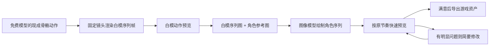

# 白模 → 序列帧图片 → 角色绘画：轻量技术路线

更新：2026-09-21。适用：用现成免费骨骼动画，为同一角色制作待机、行走、跑步、普通攻击等动作。

**先复用成熟动作，再让图像模型画角色，最后播放检查。目标是快速得到可用动画，不把每次试作变成精修工程。**

## 一、路线与分工



| 素材 / 工具 | 负责什么 |
| --- | --- |
| 现成骨骼动画 | 身体动作、步态、关节运动和原始节奏 |
| 固定相机渲染的白模图 | 每帧姿势、朝向、尺寸与位置参考 |
| 同一张角色参考图 | 脸、发型、服装、配色和画风 |
| 图像模型（用户使用的 GPT Image 等） | 依据白模姿势绘制角色；补充衣摆、头发等外观 |
| 切帧与预览程序 / Godot | 精确切帧、保存时长、播放和导出 |

这条路线不需要 AI 重新设计白模动作，也不需要给白衣长发角色制作完整 3D 模型、服装和绑定。Wan Animate 等视频生成流程不属于必需步骤。其他视频实验仍作为独立历史路线保留。

白模提供结构参考，不会自动把骨骼绑定传给图像模型。因此角色绘制仍可能有腿长、膝盖、手臂偏差或细节闪烁；不能把“用了白模”写成“严格锁定骨骼”。

## 二、最少输入

每次先明确五件事：**角色参考、动作名称、视角、帧数、节奏**。

- 已有通过的白模动作就复用，避免重新选动作或重新渲染。
- 新动作先检查免费模型的实际动画列表，再选合适片段；不能因为有跑步就声称也已经做完待机或攻击。
- 一套角色尽量沿用同一白模模型、相机、缩放与画布，减少动作切换时大小跳变。
- 保存模型来源、许可、文件哈希与实际动画名。免费不等于任意转载或商用。

本地已有实例：Quaternius 的 `UAL1_Standard.glb`，动作 `Jog_Fwd_Loop`；已保存来源记录标注为 CC0-1.0。参考包入口：[Universal Animation Library](https://quaternius.itch.io/universal-animation-library)。具体资产以下载时的来源和许可记录为准。

## 三、执行步骤

### 1. 导出白模序列

固定侧视正交相机、画布、人物缩放、原点和地面参考。将指定动作渲染为独立 PNG，再按从左到右、从上到下拼成参考图。

- 循环动作按 `t(i) = i × T / N` 采样，`i = 0…N−1`；不要再追加重复的循环起点。
- 待机、走路、跑步先用等时间；攻击按实际需求保留不等时间。时长另存文件。
- 非循环攻击需覆盖收势终点，不照搬循环动作排除重复终点的规则。
- 保留跑步的正常腾空与身体起伏；不要把每帧最低点都贴到地面。
- 不按每帧包围盒自动居中、缩放。若选择原地动作，游戏里的移动由控制器处理。
- 白模图保持干净，不带头发、服装、刀光、说明文字或预览界面。

现成慢跑例子：25 帧、5×5，每帧 512×512，图集 2560×2560；一轮约 0.933333 秒，每帧约 37.333 ms。这是此动作的参数，不是所有动画的固定模板。

### 2. 先看白模动作

播放一轮或循环预览，确认动作选对、朝向合适、全身完整、接缝没有明显跳变。已通过的同一白模素材不重复要求用户验收。

这里渲染的是确定的现成骨骼动画，不是抽取 AI 候选视频，不必额外引入视频生成与选片步骤。

### 3. 根据白模绘制角色序列

给图像模型两类明确参考：**白模图管动作，角色图管外观**。先做一版完整动作，保持帧顺序和节奏。

- 默认按用户提供的整张序列图工作；确因清晰度需要分段时，小组之间始终使用同一角色参考，不默认拆成 25 次独立重画。
- 要求保留各帧髋、膝、脚、肩、肘、手的大致位置、身体比例及朝向；衣服和头发跟随动作。
- 精确网格和最终打包交给程序，生成后检查实际格数与边界，不能只凭提示词中的“5×5”直接等分。
- 先关注动作和一致性；避免复杂纹样、细碎发丝、闪亮装饰与大量特效增加帧间变化。
- 实际输出分辨率需查看文件。例如 1254×1254 的 5×5 整图，每格只有约 250 像素；放大后不能称为新增了高清细节。

### 4. 快速预览，明显问题才修改

按原顺序和时长播放，提供暂停、逐帧、慢速即可。先看原速整体感觉，再查明显异常的几帧。

只检查四项：

1. 是否能清楚看出待机、行走、跑步或攻击，循环是否突兀。
2. 人物大小和位置是否明显跳变，腿长、膝盖和手臂是否明显跑偏。
3. 脚有没有明显漂浮、穿地，正常腾空是否保留。
4. 脸、衣服、头发是否出现明显闪烁或换造型。

处理保持简单：整段偏移用统一位置调整；少数坏帧优先修对应图片或局部；细节闪烁先简化纹样、统一主要颜色。需要时临时叠加白模查看，不默认逐帧标注关节或搭建追踪系统。

明显全段比例错误时，回查角色参考与白模比例，再重做该段。修过后整段播放一次。轻微衣摆变化不必无限打磨；本轮优先“动作可读、主体稳定、能用”。一次修改仍无改善时记录问题，再决定是否继续，不自动无限重生。

### 5. 满意后导出

保存独立 PNG、图集、帧时长和统一锚点，再接入 Godot。输出透明素材时检查真实 Alpha；去底、切帧、打包不再次调用生图来改变角色。

同一套角色的待机与移动需放在一起切换播放，检查大小、朝向、持武器状态及姿势衔接。不同角色的旧动作不能算作这套角色已完成的资产。

## 四、可直接复用的绘制提示词

将花括号内容替换为本次已确认参数；这是下一次可用的模板，不是历史图片的原始提示词。

> 图 A 是动作白模序列，图 B 是唯一角色外观参考。请将图 A 的人偶绘制为图 B 中同一个角色，制作「{动作名称}」的 {N} 帧序列图，排列为 {行数} 行 × {列数} 列，从左到右、从上到下对应，不能遗漏、重复或调换帧。以图 A 保留每帧动作、朝向、身体比例、人物位置及关节位置，不重新设计动作；以图 B 保持脸、发型、服装、配色和画风一致。人物尺度和相机固定，全身完整，保留动作本来的起伏及腾空。头发和衣摆自然跟随，主要装饰一致，减少细碎花纹。背景使用统一的 {背景}，不要文字、编号、格线、地面辅助线或额外特效。目标是适合切帧播放的角色序列，不是多张独立姿势海报。

这段提示词是约束意图，不是像素或关节完全一致的保证；仍需实际预览。

## 五、交付与轻量记录

建议每个动作只保存一套清楚的目录：

```text
动作名/
  source.json          # 模型来源/许可/哈希、动画名、角色参考
  white_frames/        # 原始白模 PNG
  white_sheet.png      # 白模参考图
  character_sheet.png  # 角色绘制候选
  timing.json          # 顺序、各帧时长、是否循环
  preview/             # 可播放预览
  notes.md             # 实际提示词、问题、修改与验收状态
```

最少记录输入/输出哈希、画布尺寸、帧数、时长和版本；实际模型名、种子未知就写 `unknown`。这些是简单文件记录，不要求新增数据库或自动审核系统。预览能播放、动作通过、角色外观通过分别记录；看不清的项写 UNKNOWN。

## 六、目前做到哪里

截至本次整理，按本地文件和会话确认：

- 免费 Quaternius 慢跑白模已导出 25 帧，用户已认可白模动画。
- 白衣长发角色已做跑步序列候选；仍有腿长、膝盖、手臂偏差及外观闪烁，未定稿。
- 白衣长发角色还没有配套完成的待机动画。下一项适合从现成模型里选择待机，沿用本路线制作。
- 旧版黑发红围巾剑士有待机、行走、普通攻击及三连斩，属于另一套角色。
- Wan Animate 2 本地实验未产出成功角色视频；用户已明确要求回到这条轻量图片路线，不把那次环境配置作为后续前置条件。

本次提交只有路线文档与入口更新，不包含上述本地模型、图片或视频，也不表示新动作已经生成。后续 Agent 直接从当前动作的素材和实际状态继续，不重新搭建整套环境。
